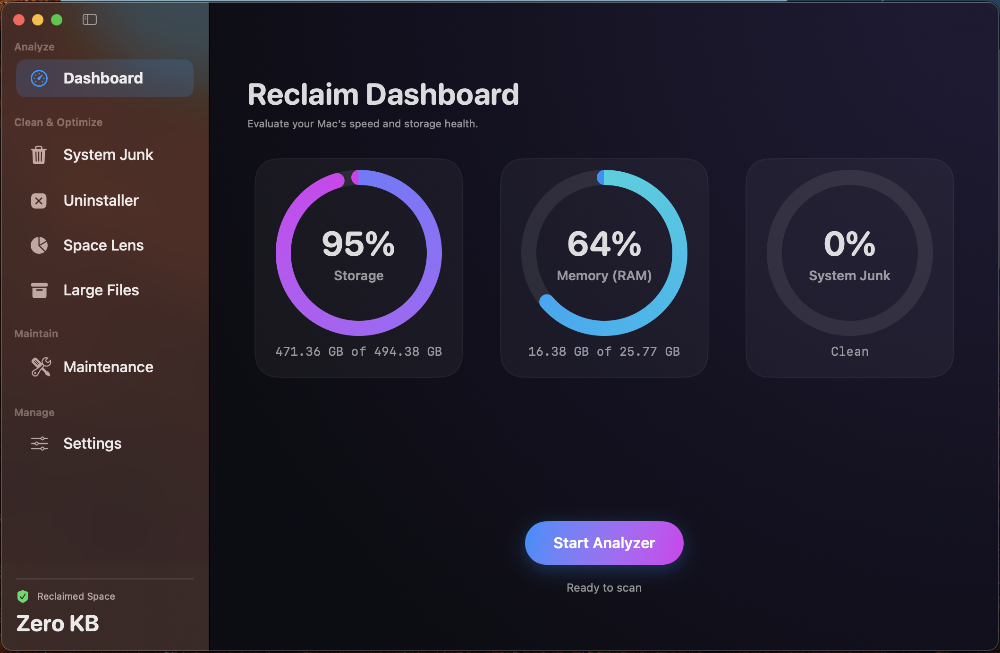

# Reclaim - Native macOS System Optimizer & Cleaner

**Reclaim** is a lightweight, high-performance, native macOS utility designed to clean temporary junk files, uninstall applications, analyze disk space interactively, and optimize system memory. Built with SwiftUI and Swift 6, Reclaim provides a premium dark-themed design system resembling CleanMyMac.





---

## 🚀 Key Features

* **System Junk Cleaner:** Scans and removes User Caches, User Logs, System Caches, System Logs, Xcode Developer DerivedData, and Trash Bins.
* **AppleScript Permissions Fallback:** Utilizes Finder AppleScript integration to query and empty the `.Trash` directory when standard POSIX file system access is blocked by macOS TCC.
* **App Uninstaller:** Scans applications and traces associated support files (caches, preference plists, container storage) to uninstall them completely.
* **Space Lens:** An interactive nested squarified treemap layout visualizer enabling you to scan folders in parallel and drill down into subdirectories by double-clicking blocks.
* **Large Files Finder:** Scans and lists files over 100MB in downloads and documents, with built-in "Reveal in Finder" quick actions.
* **Maintenance Suite:** Free up inactive RAM, flush local DNS caches, and trigger Spotlight search database re-indexing.

---

## 🛠️ Tech Stack & Architecture

* **Swift 6 & SwiftUI:** Strict concurrency and state updates using the modern `@Observable` framework.
* **XcodeGen Integration:** Project build configurations are managed cleanly in `project.yml`, generating the `.xcodeproj` file programmatically.
* **Non-Sandboxed Design:** Runs outside the App Sandbox (`com.apple.security.app-sandbox = false`) to allow low-level system directory traversal.
* **Apple Events Automation:** Integrated Finder scripting support for querying and emptying system Trash.

---

## 💻 Development & Compilation

### Project Generation
Ensure `xcodegen` is installed, then generate the project file:
```bash
xcodegen
```

### Building the Application
To compile and build the target binary:
```bash
xcodebuild -project Reclaim.xcodeproj -target Reclaim -configuration Debug build
```

### Running the App
Once compiled, you can launch the application from the workspace directory:
```bash
open build/Debug/Reclaim.app
```

### Debugging Logs
Diagnostics are written progressively to the workspace debugging log:
```bash
tail -f app_debug.log
```

---

## 📦 Distribution & Notarization (Direct Distribution)

Because Reclaim runs unsandboxed to perform cleanup operations, it is distributed **outside the Mac App Store** (via direct DMG download or package managers like Homebrew).

To sign and notarize the app for Gatekeeper compatibility:

1. **Notary Profile Setup:** Create an App-specific password and run:
   ```bash
   xcrun notarytool store-credentials "ReclaimNotary" --apple-id "developer-id@email.com" --team-id "TEAMID" --password "app-specific-password"
   ```
2. **Compress Archive:** Zips the compiled app bundle:
   ```bash
   ditto -c -k --keepParent build/Debug/Reclaim.app build/Reclaim.zip
   ```
3. **Submit to Apple Notary:**
   ```bash
   xcrun notarytool submit build/Reclaim.zip --keychain-profile "ReclaimNotary" --wait
   ```
4. **Staple Notarization Ticket:**
   ```bash
   xcrun stapler staple build/Debug/Reclaim.app
   ```
